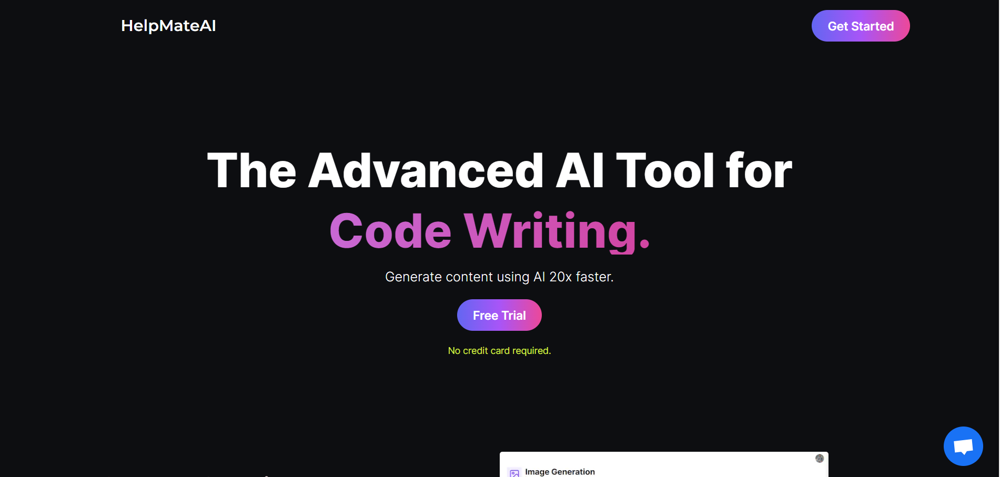
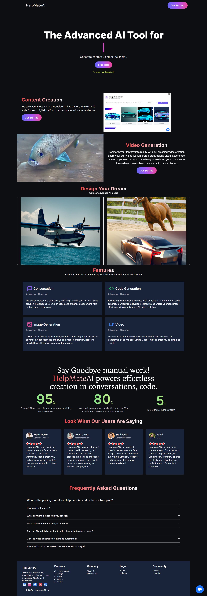
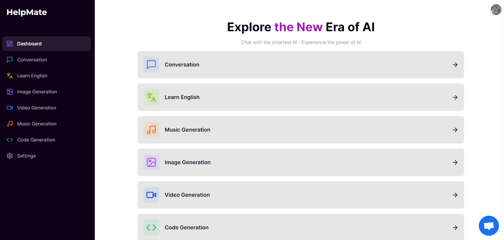

# HelpMateAI 

HelpMateAI is a versatile SaaS (Software as a Service) project that integrates powerful AI capabilities to enhance various aspects of user interaction and learning. The project focuses on conversing with AI, learning English with AI assistance, generating images, videos, and audio content etc.

# Project Video
[)
## Features

### 1. Conversation With AI
Engage in meaningful and dynamic conversations with our advanced AI system. The AI is designed to provide intelligent responses, making interactions more natural and valuable.

### 2. Learn English with AI
Accelerate your English language learning journey with the dedicated Learn English feature. Leverage AI-driven language learning tools to improve your proficiency in a personalized and effective manner.

### 3. Image Generation
Create stunning and unique images effortlessly using our AI-powered image generation feature. Unleash your creativity or use it for various design purposes.

### 4. Video Generation
Generate captivating videos with the Video Generation feature. Whether it's for social media content or professional presentations, our AI makes video creation a seamless process.

### 5. Audio Generation
Need custom audio content? Our AI-driven Audio Generation feature allows you to generate audio for various purposes, from podcasts to background music.

### 6. Code Generation
Empower your development process with our Code Generation feature. Quickly generate code snippets for common tasks, prototypes, or boilerplate code, saving time and effort in your coding endeavors.

### Overview

### Dashboard

## Free Trial and Premium Features

Experience HelpMateAI with our free trial, offering 5 credits to explore the platform's capabilities. After the trial period, users can choose to upgrade to our premium service to unlock unlimited access to all features.

## Free Trial and Premium Features

Experience HelpMateAI with our free trial, offering 5 credits to explore the platform's capabilities. After the trial period, users can choose to upgrade to our premium service to unlock unlimited access to all features.

### Free Trial
- Users get 5 credits during the free trial period.
- Points can be used to access and explore all features of HelpMateAI.

### Premium Features
- Unlock unlimited access to Conversation With AI, Learn English with AI, Image Generation, Video Generation, and Audio Generation.
- Seamless and uninterrupted usage with premium membership.

## Technologies Used

- **Next.js**: A React framework for building efficient and scalable web applications.
- **Prisma ORM**: Database toolkit for TypeScript and Node.js, providing a type-safe and auto-generated query builder.
- **Clerk Authentication**: Simplify user authentication with Clerk, offering secure and easy-to-integrate authentication solutions.
- **Shadcn UI**: Beautifully designed components that you can copy and paste into your apps.
- **Tailwind CSS**: A utility-first CSS framework that makes styling your applications fast and easy.
- **OpenAI**: Harness the power of OpenAI's language models for advanced natural language processing and understanding.
- **MySQL Database**: Use MySQL as the relational database management system to store and manage data efficiently.
- **Vercel**: Deploy your Next.js applications with ease using Vercel's hosting platform.
- **Crisp**: Integrate Crisp for seamless and interactive customer support and chat features.
- **Stripe**: Enable secure online payment processing with the Stripe API.

## Getting Started

1. Clone the repository: `git clone [https://github.com/your-username/HelpMateAI.git](https://github.com/EmranSWE/HelpMateAI.git)`
2. Install dependencies: `npm install`
3. Configure your environment variables.
4. Run the application: `npm run dev`

For detailed instructions on setting up and configuring each feature, just [text me](mdemran.swe@gmail.com)

## Deployment

Deploy your application using Vercel or your preferred hosting provider. Ensure that you configure the necessary environment variables for production deployment.

## Support and Feedback

For support and feedback, contact us at mdemran.swe@gmail.com. I welcome any suggestions or bug reports to improve the overall user experience.

Thank you for choosing HelpMateAI! Enjoy exploring the capabilities of our AI-powered platform.

